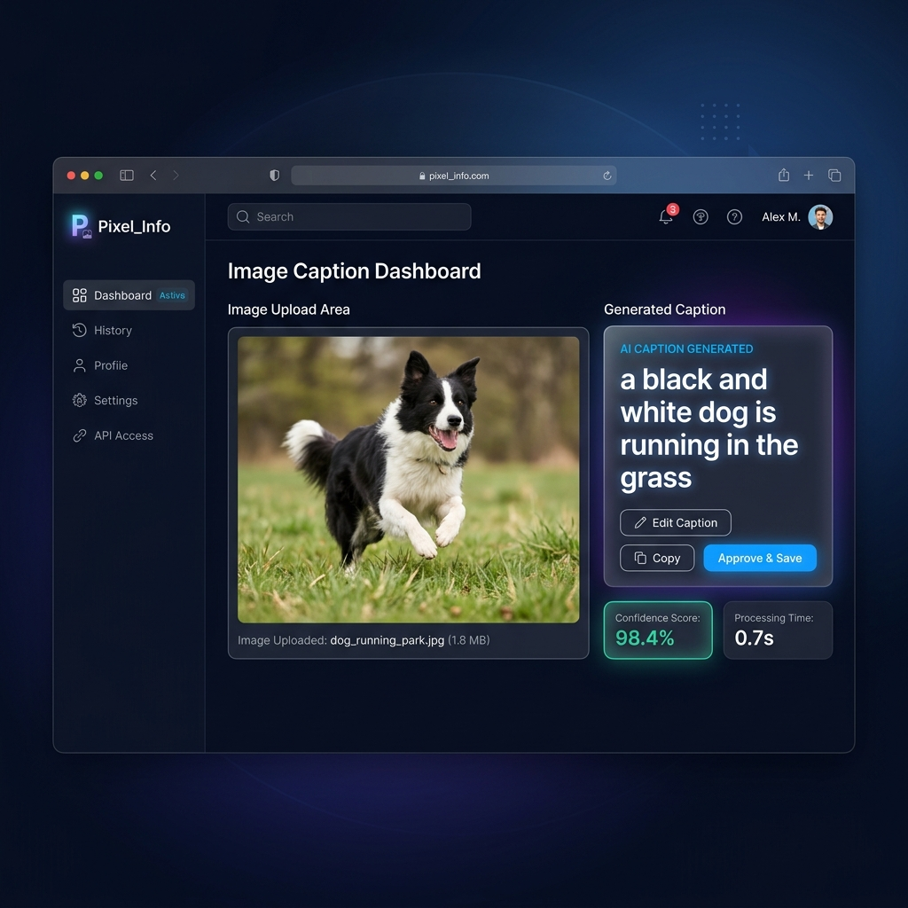
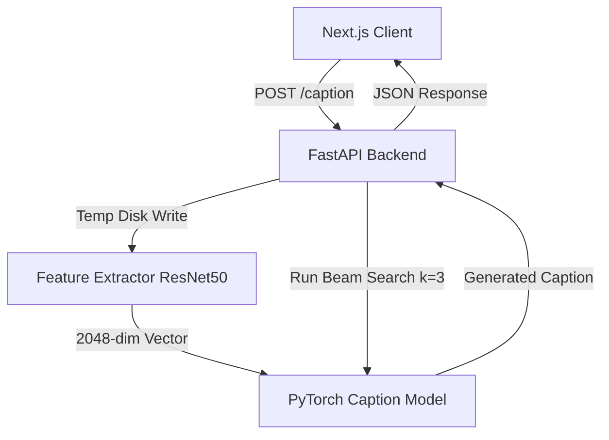

# Pixel_Info: AI Image Caption Generator

An end-to-end deep learning system that generates natural language captions for images. It combines a **ResNet50** CNN feature extractor with an **LSTM** sequence model in PyTorch, served via a **FastAPI** REST backend, and presented through a modern **Next.js 15** frontend.



---

## 1. Project Overview
Pixel_Info is a production-ready image captioning application. The model utilizes a transfer learning approach, leveraging a pre-trained ResNet50 model (trained on ImageNet) to extract high-dimensional visual feature vectors, and feeds them into a custom LSTM network initialized with Xavier weights. Text generation supports both Greedy Decoding and an upgraded **Beam Search Decoding** algorithm with length normalization to produce high-quality, diverse descriptions.

---

## 2. Features
*   **On-the-Fly Feature Extraction**: Upload any image and extract 2048-dimensional embeddings using a preloaded ResNet50 model.
*   **Beam Search Decoding**: Decodes captions by maintaining the top-$k$ highest-scoring hypotheses (configured at $k=3$ with length normalization $\alpha=0.75$).
*   **Greedy Decoding Fallback**: Automatically falls back to greedy decoding when the beam width is set to 1.
*   **REST API Backend**: Fast and structured endpoints built with FastAPI, incorporating preloaded model lifecycle management (single-load startup caching).
*   **Interactive Web UI**: Modern SaaS-style dashboard built with Next.js 15, TypeScript, and Tailwind CSS v4, supporting drag-and-drop file uploads, image previews, loaders, and copy-to-clipboard actions.
*   **GPU Acceleration**: Automated CUDA hardware mappings for both feature extraction and model inference.

---

## 3. System Architecture
The application is decoupled into three main layers:
1.  **Frontend Interface**: A Next.js Web App that communicates with the API via AJAX multipart uploads.
2.  **FastAPI Backend**: Preloads the PyTorch model and vocabulary mappings, receives image uploads, extracts features, runs the decoder, and returns the response.
3.  **Inference Pipeline**: PyTorch-based core decoder handling greedy and GPU-batched beam search algorithms.



---

## 4. Model Architecture
*   **Visual Encoder**: Pre-trained ResNet50 backbone (classification layer removed) extracting a `(1, 2048)` feature vector.
*   **Feature Mapping**: Fully Connected linear layer mapping `2048 -> 512` features with ReLU activation and Dropout.
*   **Sequence Decoder (LSTM)**:
    *   Input: `startseq` padded token sequences.
    *   Word Embeddings: 512-dimensional learnable word vectors.
    *   Fusion Block: Element-wise addition of visual features and sequence features.
    *   Classifier: Linear projection mapping to the vocabulary size (`2970` tokens) with Softmax.
*   **Total Parameters**: 6,457,242 parameters, initialized using Xavier initialization.

---

## 5. Dataset
The model is trained on the **Flickr8K Dataset** (8,092 images, each annotated with 5 human reference captions).
*   **Preprocessing**: Captions are cleaned (lowercased, punctuation removed, rare tokens pruned), wrapped in boundary tags (`startseq` / `endseq`), and tokenized.
*   **Sequence Dimensions**: Maximum caption sequence length is `38` tokens. Vocabulary size is `2,970` unique words.
*   **Train/Validation Split**: 80% Train (381,087 sequence slices) / 20% Validation (96,009 sequence slices) split at the image level to prevent data leakage.

---

## 6. Training Pipeline
*   **Optimizer**: Adam Optimizer.
*   **Loss Function**: Cross-Entropy Loss.
*   **Regularization**: Dropout (0.5), early stopping, and `ReduceLROnPlateau` scheduler.
*   **Mixed Precision**: NVIDIA AMP (Automatic Mixed Precision) enabled for floating-point 16 scaling.
*   **Best Checkpoint**: Validation Loss: `3.195298` (Epoch 19).

---

## 7. Evaluation & BLEU Results
The model was evaluated on the entire validation split (1,619 images) comparing Greedy Decoding vs. Beam Search ($k=3$, $\alpha=0.75$).

| Metric | Greedy Decoding | Beam Search (k=3, $\alpha=0.75$) | Improvement (%) | Best Strategy |
| :--- | :---: | :---: | :---: | :---: |
| **BLEU-1** | 0.512928 | 0.470155 | -8.34% | Greedy Decoding |
| **BLEU-2** | 0.302009 | 0.283841 | -6.02% | Greedy Decoding |
| **BLEU-3** | 0.160226 | 0.167773 | +4.71% | Beam Search |
| **BLEU-4** | 0.102222 | 0.113455 | **+10.99%** | Beam Search |
| **Average Length** | 10.08 words | 11.39 words | +13.09% | Beam Search |
| **Vocabulary Diversity** | 41 unique words | 47 unique words | **+14.63%** | Beam Search |

### Key Findings
*   **Quality Boost**: Beam Search improves BLEU-4 by **+10.99%** over greedy decoding, indicating structurally more accurate descriptions.
*   **Reduced Mode Collapse**: Vocabulary diversity increased by **+14.63%**, generating more descriptive terms (e.g. `"black and white dog"` instead of `"dog"`).

---

## 8. Technology Stack
*   **Core DL**: PyTorch, TorchVision
*   **Backend**: FastAPI, Uvicorn, Pydantic, python-multipart
*   **Frontend**: Next.js 15, TypeScript, Tailwind CSS v4, React
*   **Utilities**: NLTK (BLEU metrics), Matplotlib (training plots), Pandas, NumPy

---

## 9. API Documentation
The FastAPI backend serves REST endpoints:

### `GET /`
Check API metadata and running status.
*   **Response**: `{"project": "Pixel_Info", "status": "running"}`

### `GET /health`
Get service health status.
*   **Response**: `{"status": "healthy"}`

### `POST /caption`
Upload image bytes to generate a caption.
*   **Request**: `multipart/form-data` with `file: UploadFile`
*   **Response**:
    ```json
    {
      "success": true,
      "caption": "a black and white dog is running in the grass"
    }
    ```

---

## 10. Installation & Local Setup

### Prerequisites
*   Python 3.10+
*   Node.js 18+

### Step 1: Clone the Repository
```bash
git clone https://github.com/your-username/Pixel_Info.git
cd Pixel_Info/image-caption-generator
```

### Step 2: Set Up Python Backend
1.  Run the setup script to configure a virtual environment and install dependencies:
    ```powershell
    setup.bat
    ```
2.  Activate the environment:
    ```powershell
    venv\Scripts\Activate.ps1
    ```
3.  Start the FastAPI server:
    ```powershell
    python -m uvicorn src.api.main:app --host 127.0.0.1 --port 8000
    ```

### Step 3: Set Up Next.js Frontend
1.  Navigate to the frontend folder:
    ```bash
    cd frontend
    ```
2.  Install packages:
    ```bash
    npm install
    ```
3.  Run the development server:
    ```bash
    npm run dev
    ```
4.  Open `http://localhost:3000` in your browser.

---

## 11. Future Improvements
*   **Attention Mechanism**: Add Luong/Bahdanau visual attention layers to resolve base model mode collapse and map words to local image regions.
*   **Transformer Backbone**: Swap out LSTM for a Vision Transformer (ViT) or GPT-style decoder.
*   **Batch GPU Inference API**: Support batch image captioning via REST request arrays.

---

## 12. License
This project is licensed under the MIT License - see the LICENSE file for details.
